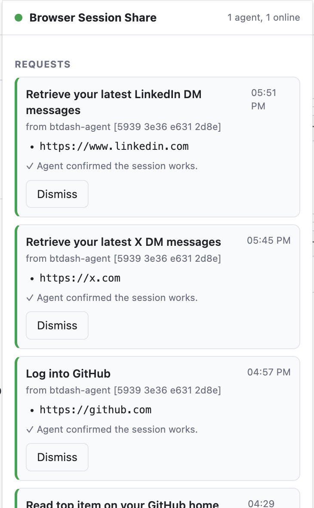

# Browser Session Share — MVP

A remote coding agent drives its own browser. When it hits a login wall, a human
completes the login in their own Chrome and the agent receives a usable session
for the affected origins. Implements §13 of `browser-session-share-spec.md`.

<p align="center">
  
</p>

```
 agent (any browser driver)   relay (this repo)          human's Chrome
 ──────────────────────────   ─────────────────          ──────────────
 browser-handoff request ───────────▶ queue ──────WS───────────▶ request window
                                                          human logs in, clicks Done
 bundle.json ◀── browser-handoff request ◀──HTTPS── queue ◀─HTTP─ session_bundle (sealed box)
 import cookies + localStorage, reload, browser-handoff report ──▶ ✓ / ✗ shown in extension
```

Payloads are end-to-end encrypted (X25519 sealed boxes via tweetnacl); the relay
stores opaque envelopes only. Every envelope is Ed25519-signed by its sender and verified by the recipient (spec §5).

## Install

Basic steps:

1. **Install the Chrome extension** in your browser.
2. **Install the Agent skill** on the machine where your agent runs (it carries the `browser-handoff` CLI).
3. **Pair your agent to the Chrome extension:** run `browser-handoff pair --name <agent>` and enter the
   printed code in the extension.

Details for each below.

### Chrome extension

The extension is prebuilt at [`dist/browser-handoff-extension.zip`](dist/browser-handoff-extension.zip)
([direct download](https://github.com/freeflow-community/browser-session-share/raw/main/dist/browser-handoff-extension.zip)).

1. Download and unzip it into a folder you'll keep (the extension runs from that folder).
2. Open `chrome://extensions`, turn on **Developer mode** (top right).
3. Click **Load unpacked** and select the unzipped folder.
4. Pin the **Browser Session Share** icon. It defaults to the hosted relay
   `https://browser-relay.freeflow.im`, so no configuration is needed.
5. Pair it with an agent: get a code from `browser-handoff pair --name <agent>` (below), open the
   extension, **Add agent**, and enter the code.

(To rebuild the zip after changing the extension: `npm run build:ext`.)

### Agent (skill + CLI)

The `browser-auth-handoff` skill carries the `browser-handoff` CLI and the bundle importer, so
installing the skill is the whole agent-side install (no `npm install`; crypto is vendored).

Quickest, if you have the skill CLI:

```sh
npx skill add freeflow-community/browser-session-share
```

**Or, copy this prompt into your coding agent** (Claude Code, etc.):

```text
Install the "browser-auth-handoff" skill from https://github.com/freeflow-community/browser-session-share
so you can hand off authenticated browser sessions from a human's Chrome:

1. Clone the repo (git clone https://github.com/freeflow-community/browser-session-share), or git pull if
   you already have it.
2. Symlink its skill into your skills directory, e.g.:
   ln -s "$PWD/browser-session-share/skills/browser-auth-handoff" ~/.claude/skills/browser-auth-handoff
3. The CLI is embedded at skills/browser-auth-handoff/scripts/handoff/browser-handoff.mjs and runs
   on Node with no install. Read the skill's SKILL.md and follow it.
4. Start the shared browser (browser-handoff browser start) and attach over its CDP endpoint; when
   you hit an auth wall, run `browser-handoff request --origins <origin> --hint <url> --load`.

Then confirm the skill is installed and summarize how you'll use it.
```

Or install it manually:

```sh
git clone https://github.com/freeflow-community/browser-session-share
ln -s "$PWD/browser-session-share/skills/browser-auth-handoff" ~/.claude/skills/browser-auth-handoff
```

## Security

Sharing a session is sharing a credential, so a few things keep it safe:

- **You log in, not the agent.** You type your password in your own Chrome. The agent never
  sees your password, only the resulting session (cookies + localStorage) for the origins you approve.
- **You approve every share.** Nothing leaves your browser until you click Done. The request shows
  which agent is asking, what task, and which sites, and you can Decline. A built-in denylist blocks
  sensitive origins (identity providers, banking).
- **The agent is who it says it is.** You pair each agent once by entering its code and confirming its
  fingerprint. Every message is signed with that agent's key, so a request is provably from your paired
  agent and can't be forged or impersonated.
- **Only your agent can read it.** The session is encrypted end-to-end with the agent's public key
  (X25519 sealed box). Only that agent can decrypt it.
- **The relay is untrusted.** It just routes sealed, signed envelopes between you and the agent; it
  never sees your session or your password and can't forge messages.
- **You stay in control.** Each agent is separate; revoke any one at any time, from the extension or
  the CLI, and its access ends immediately.

## Layout

| Path | What |
|---|---|
| `relay/` | Single-process relay: pairing registry, per-pairing queues, WebSocket for the extension, long-poll for the CLI, plus a per-pairing CONNECT/forward **proxy** for tier 2. In-memory with a JSON snapshot (`relay/data/state.json`). |
| `extension/` | Chrome MV3 extension. Registers **many agents** (an Agents list with add / rename / revoke), one WebSocket per pairing. A request auto-opens a compact window (Start / Done / Decline) labeled with the requesting agent; after Start, a floating panel is injected onto the login tab so Done is right there, surviving the login redirects. Exports cookies (`chrome.cookies`) and localStorage for the requested origins. For tier 2, applies a scoped PAC so the login egresses through the relay proxy. |
| `skills/browser-auth-handoff/scripts/handoff/` | The **`browser-handoff` CLI** (embedded in the skill, zero npm deps — vendored crypto): `pair | request | report | proxy | agents | use | status | revoke`. Config in `$HANDOFF_HOME` or `~/.handoff/`. |
| `skills/browser-auth-handoff/` | **How an agent uses this.** Agent-facing skill: recognize an auth wall (agent's own judgment), request a session with the `browser-handoff` CLI, import the bundle, verify, report. Bundles a reusable Playwright importer (`scripts/import-bundle.mjs`) and per-driver recipes for Puppeteer / chrome-devtools MCP / CDP (`reference/drivers.md`). |
| `testsite/` | Local toy site with a cookie-auth app and a localStorage-token app. |
| `test/e2e.mjs` | Automated run of the four MVP success criteria with the real extension loaded in Chromium. |
| `test/agent-sim.mjs` | The scripted "agent" the e2e suite drives (request → import → verify → report), so the suite exercises the full stack without a real LLM. Not a component anyone runs by hand — a real agent follows the skill instead. |

## Quick start

Requires Node 20+ and Chrome 116+.

By default the CLI and extension use the hosted relay at `https://browser-relay.freeflow.im`, so
you can skip running your own. Override it with `--relay` / `HANDOFF_RELAY` (CLI) or the popup's
Relay field (extension) — for local development, point both at `http://127.0.0.1:8787`.

```sh
npm install
npx playwright install chromium     # for the e2e test

# the CLI is embedded in the skill (no install needed); alias it for readability:
alias browser-handoff="node $PWD/skills/browser-auth-handoff/scripts/handoff/browser-handoff.mjs"

# 1. extension: chrome://extensions → Developer mode → Load unpacked → ./extension

# 2. pair (uses the hosted relay by default)
browser-handoff pair --name my-agent
#   prints a code like  ABCD-EFGH ; enter it in the extension popup

# — or run everything locally —
npm run relay                       # http://127.0.0.1:8787
browser-handoff pair --name my-agent --relay http://127.0.0.1:8787
#   in the popup, set the Relay field to http://127.0.0.1:8787 before entering the code
```

Now an agent can request a session whenever it hits an auth wall. By hand, against the
local test site (user `alice` / password `wonderland`):

```sh
npm run testsite                    # http://127.0.0.1:4321

# ask for a session; a request window pops in Chrome — click Start, log in, click Done
browser-handoff request \
  --origins http://127.0.0.1:4321 \
  --hint http://127.0.0.1:4321/cookie/app \
  --label "Read the cookie app" \
  --out ./session.json

# then import ./session.json into your browser context and continue (see the skill)
node skills/browser-auth-handoff/scripts/import-bundle.mjs ./session.json http://127.0.0.1:4321/cookie/app
browser-handoff report --ok
```

`HANDOFF_RELAY` (or `--relay`) overrides the default relay for `browser-handoff pair`; the relay URL is
stored with the pairing afterwards, so later commands reuse it.

## Using it from an agent

`skills/browser-auth-handoff/` is a Claude Code skill: it tells any agent driving a browser
how to recognize an auth wall (its own judgment, no detector), request a session with the
`browser-handoff` CLI, import the bundle with `scripts/import-bundle.mjs` (Playwright) or the
`reference/drivers.md` recipes (Puppeteer, chrome-devtools MCP, CDP), verify, and report. To
make it available to Claude Code, copy or symlink it into a skills directory:

```sh
ln -s "$PWD/skills/browser-auth-handoff" ~/.claude/skills/browser-auth-handoff
```

## CLI

```
browser-handoff pair    --name NAME [--relay URL]
browser-handoff request --origins a,b [--hint URL] [--label TEXT] [--timeout 30m] [--out FILE] [--tier 1|2]
browser-handoff report  [--request ID] (--ok | --failed "reason")
browser-handoff proxy   --origins a,b
browser-handoff browser <start|status|stop|endpoint>   # shared browser (see below)
browser-handoff load    --bundle FILE                  # inject a bundle into the shared browser
browser-handoff status
browser-handoff revoke  [PAIRING_ID]
```

`request` writes the bundle to `--out` and prints `{"request_id","proxied":false,"silent":false,"out"}`
on stdout. Exit codes: 0 bundle, 2 declined, 3 timeout, 4 unpaired. Re-running `request` with the
same origins while one is pending resumes it (same `request_id`) instead of raising a second badge.
`report` defaults to the most recent completed request.

## Bundle

Superset of Playwright `storageState` (spec §6): `cookies[]`, `origins_storage[].localStorage[]`,
plus `origins`, `env` (userAgent, acceptLanguage, timezone, viewport). `sessionStorage`,
`indexedDB`, silent renewal, and per-pairing policy are deferred per §13.

## Tier 2 (IP-bound sessions)

Some sites bind a session to the IP it was minted from, so a bundle replayed from the agent's
IP is rejected. Tier 2 routes both the human's login and the agent's later traffic through the
relay's per-pairing proxy, so both share the relay's egress IP.

- `browser-handoff request --tier 2 …` sends a tier-2 request. On Start, the extension applies a scoped
  PAC (only the requested hosts go through the proxy) and answers the proxy's auth challenge.
- The reply's stdout JSON comes back `{"proxied": true, "proxy": {server, username, password}, …}`.
  The agent builds its browser context with that proxy (the skill's importer takes a `proxy` option).
- Tier is learned: a failed tier-1 report marks the origins as tier-2 candidates, so a later
  `request` without `--tier` escalates automatically. `browser-handoff proxy --origins a,b` prints the
  proxy settings when those origins are known to need it, else `null`.

Egress stickiness is per pairing; in the single-process relay there is one egress IP, so a real
multi-egress deployment is still future work (§12).

## Multiple agents / browsers

Design in `multi-agent-spec.md`; Phase 1 is implemented.

- **Many agents, one browser.** The extension registers several agents at once, each a separate
  pairing to its own agent identity, each with its own WebSocket. The popup's Agents list adds
  (paste a code), renames, and revokes them individually. Every request is attributed to the
  agent it came from — verified by that pairing's token and Ed25519 signature, never a
  self-asserted field — and the badge, window, and in-page panel name that agent.
- **One agent, many browsers.** Pair each browser (optionally `browser-handoff pair --label NAME`).
  `browser-handoff agents` lists them; `browser-handoff request --pairing <id|label>` targets one; `browser-handoff use
  <id|label>` sets the default so a plain `request` goes there (otherwise the newest pairing).
- **Tier-2 caveat:** only one tier-2 login runs at a time per browser, since the proxy auth
  can't tell which agent a connection belongs to; a second tier-2 Start is refused until the
  first finishes.

## Shared browser (persistent box)

For a long-lived box that runs many agent sessions, don't import a bundle per request. Run
**one persistent Chrome** that agents attach to over CDP; credentials load into its profile
once and stay.

```sh
browser-handoff browser start          # one Chrome, persistent profile, remote debugging
browser-handoff browser endpoint       # e.g. http://127.0.0.1:9222
```

Agents attach to that endpoint instead of launching their own browser (Playwright
`chromium.connectOverCDP(endpoint)`, Puppeteer `connect`, or the chrome-devtools MCP) and open
a tab in the shared profile. When an agent hits a wall, it requests **with `--load`** so the
session is injected straight into the shared browser (cookies via CDP `Storage.setCookies`,
localStorage via a throwaway tab), no per-request import:

```sh
browser-handoff request --origins https://app.example.com --hint https://app.example.com/login --load
```

Config: `BROWSER_HANDOFF_CHROME` (path to Chrome/Chromium, if not auto-found), `--port`
(default 9222), `--profile` (default `~/.handoff/browser-profile`), `--headed` (default headless).

Caveats: the shared profile is one cookie jar, so concurrent agents share identity per site;
one Chrome owns the profile (agents connect, they don't each launch); tier-2 (IP-bound)
sessions are not proxied in the shared browser yet.

## Tests

```sh
npm run test:e2e        # extension + relay + CLI, end to end (HEADED=1 to watch)
npm run test:shared     # shared-browser mode: CDP credential loader (7 checks)
```

The e2e starts a relay and the test site on private ports, launches Chromium with the extension,
pairs through the popup, logs the "human" in, runs the agent sim against both apps, kills a
pending `request` and re-runs it to prove it resumes, restarts Chromium to prove the pairing
survives, runs a full **tier-2** flow (PAC applied on Start, login and agent traffic both
through the relay proxy, proxy cleared on Done, tier learned), verifies **signature interop**
between the Node and browser crypto, registers a **second agent** on the same browser and
checks requests are attributed to the right agent and that revoking one leaves the other, and
exercises Decline. 27 checks.

## Notes and known limits

- The extension asks for `http://*/*` and `https://*/*` host permissions up front; the spec's
  per-origin on-demand permissions are a follow-up.
- Denylist is hardcoded: `accounts.google.com`, `login.microsoftonline.com`, `www.paypal.com`.
- Cookies are included when their domain equals a requested host or a parent domain of it; the
  relay-side queue keeps envelopes for 24h and dedupes by `msg_id`.
- If no tab for an origin is open when you click Done, the extension briefly opens one in the
  background to read localStorage, then closes it.
- Relay state survives restarts via `relay/data/state.json` (set `RELAY_STATE_FILE=` to disable).
